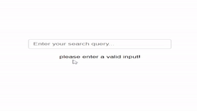

# Full-Stack Application with MeiliSearch Integration

This is a full-stack application that integrates with MeiliSearch for efficient searching of data stored in a MySQL database. The application allows users to search for products stored in the database and retrieve relevant search results in real-time.


## Features

- **Search Functionality**: Users can search for products by entering keywords or phrases in the search bar.
- **Indexing Data**: Data from the MySQL database is indexed into MeiliSearch, enabling fast and efficient search operations.
- **Frontend Interface**: Provides a user-friendly interface for interacting with the search functionality.

## Installation

1. **Clone the Repository**: Clone this repository to your local machine using `git clone`.

2. **Install Dependencies**: Navigate to the project directory and run `npm install` to install the necessary dependencies.

3. **Install MeiliSearch Locally**:
   - Download MeiliSearch from the [official website](https://docs.meilisearch.com/guides/advanced_guides/installation.html).
   - Follow the installation instructions for your operating system.
   - Start the MeiliSearch server and ensure it's running on `http://localhost:7700`.

4. **Install MySQL Locally**:
   - Download MySQL from the [official website](https://dev.mysql.com/downloads/).
   - Install MySQL following the installation instructions for your operating system.
   - Start the MySQL server.

5. **Configure MySQL Database**:
   - Access your MySQL server using a client or command line.
   - Create a database named `products` by running the following SQL command:
     ```sql
     CREATE DATABASE products;
     ```

6. **Configure MySQL Table**:
   - Inside the `products` database, create a table named `products` with the following schema:
     ```sql
     CREATE TABLE products (
       id INT AUTO_INCREMENT PRIMARY KEY,
       name VARCHAR(255),
       description TEXT,
       price DECIMAL(10, 2)
     );
     ```

7. **Configure MeiliSearch**: 
   - Update the host and API key configuration in `index.js` to match your MeiliSearch instance.
     - The `host` should point to the URL where your MeiliSearch instance is running, typically `http://localhost:7700`.
     - The `apiKey` should be replaced with your MeiliSearch API key, which can be obtained from the MeiliSearch dashboard or configuration file.

8. **Start the Application**: Run `npm start` to start the Express server.

9. **Access the Application**: Access the application in your web browser by navigating to `http://localhost:3001`.

## Usage

- Open the application in your web browser.
- Enter keywords or phrases in the search bar to search for products.
- View the search results displayed on the frontend interface.

## Folder Structure

- **config**: Contains configuration files, such as `database.js` for MySQL database configuration.
- **frontend**: Contains the frontend files, including `index.html`.
- **routes**: Contains Express route handlers, such as `search.js`.
- **index.js**: Main entry point for the Express application.

## Code Details

- **config/database.js**: This file sets up a MySQL connection pool using the `mysql2` package. It exports a function `executeQuery` that can be used to execute SQL queries asynchronously and handle errors.

- **routes/search.js**: This file defines the Express router responsible for handling search-related routes. It exports a function that takes a MeiliSearch client as a parameter. Inside this function, two routes are defined: `/index` for indexing data from the MySQL database into MeiliSearch and `/products` for searching indexed data. 

- **index.js**: This is the main entry point for your Express application. It creates an instance of the MeiliSearch client, sets up middleware to parse JSON payloads, defines routes for search functionality and serving the frontend, and starts the Express server listening on a specified port.

## Dependencies

- [Express.js](https://expressjs.com/): Web application framework for Node.js.
- [MySQL2](https://www.npmjs.com/package/mysql2): MySQL client for Node.js.
- [MeiliSearch](https://www.npmjs.com/package/meilisearch): MeiliSearch client for Node.js.

## Contributing

Contributions are welcome! If you have any suggestions, bug fixes, or feature enhancements, feel free to open an issue or create a pull request.

## License

This project is licensed under the [MIT License](LICENSE).
